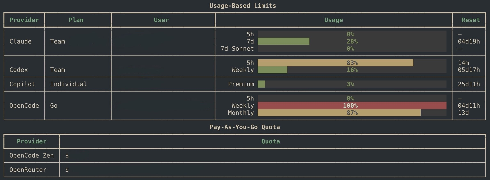

# agent-quota — GNOME navibar visualization branch

This branch adds a GNOME Shell top-bar visualization for the AI quota data. It is aimed at people who want the current allowance one click away in the navibar, rather than opening a terminal table. The original terminal app remains in the repository as the bundled data backend.

The extension has been developed on **GNOME Shell 50**. Other desktop environments, other panel implementations, and older GNOME versions have not been tested and are not claimed to work.



It tracks subscription-backed and rate-limited AI usage: rolling windows, weekly caps, monthly allowances and token buckets for **Claude**, **OpenAI Codex**, **GitHub Copilot**, **OpenCode Go**, and **Z.ai**. It also shows pay-as-you-go balances for **OpenCode Zen**, **OpenRouter**, and **DeepSeek**.

Pay-as-you-go balances are still supported, but as a secondary table for credits and prepaid balances such as `OpenCode Zen`, `OpenRouter`, and `DeepSeek`. Usage-based bars display the remaining allowance, with colour shifting to yellow below 30% and red below 10%; when a provider-wide 7-day or weekly allowance is exhausted, its other percentage bars turn muted gray-green because they are no longer actionable. Rows without a percentage render as plain text. `Claude` now resolves plan, team, and user details from its account and organization endpoints; `Codex` renders each distinct account or workspace exposed by the configured browser as its own block. Human-readable Codex team/workspace names are still limited by what those session payloads expose.

Originally based on [waybar-ai-usage](https://github.com/NihilDigit/waybar-ai-usage) by [@NihilDigit](https://github.com/NihilDigit).

## GNOME top-bar extension (the focus of this branch)

On GNOME 50 (including Wayland), install the command and extension:

```bash
./install-gnome-extension.sh
gnome-extensions enable agent-quota@torridfish
```

The installer packages the Python backend into the extension and refreshes the matching global `agent-quota` command, avoiding version skew between terminal and top-bar output. `uv` is required and prepares the extension's local runtime on its first refresh. The extension uses browser cookies for cookie-authenticated providers and stores API keys in `~/.config/agent-quota/`.

Click the gauge in the right side of the top bar for provider details. A red/yellow gauge continues to mean low quota; a small `!` badge means one or more provider fetches failed. Long provider errors are capped so the popup stays usable.

Open the popup's **Settings** action (or run `gnome-extensions prefs agent-quota@torridfish`) to:

- override `config.toml` and choose exactly which providers appear;
- configure refresh interval, colour thresholds and popup spacing;
- manage all provider-specific options from one **Providers** page, grouped by provider: for cookie-authenticated providers, select its cookie browser and open its sign-in page; for API-authenticated providers, save its API key; and adjust its popup layout options (including reset time at 100%);
- shorten only the OpenCode Go email, if desired.

Settings take effect immediately. After installing changed extension JavaScript or CSS on GNOME Shell 50 Wayland, log out and back in once if the installer reports that the in-memory module is still old.

## Install

```bash
# from a clone
uv sync
uv run agent-quota

# or install as a uv tool
uv tool install .
agent-quota
```

Requires Python 3.11+ and [uv](https://docs.astral.sh/uv/).

## Usage

```bash
agent-quota                       # one-shot table (uses ~/.config/agent-quota/config.toml)
agent-quota setup                 # interactive picker for which providers to enable
agent-quota --watch               # auto-refresh every 15s
agent-quota --watch 30            # custom interval
agent-quota --only claude,codex   # one-off subset (overrides config)
agent-quota --view usage          # show only the usage-based limits table
agent-quota --view payg           # show only the pay-as-you-go quota table
agent-quota --browser firefox     # cookie source for cookie-auth providers
```

Press `Ctrl+C` to exit watch mode. Exit code is `0` if every selected provider is OK, `1` otherwise.

## First run

The first time you run `agent-quota` without a config file, it prompts you to pick which providers to monitor and saves your selection to `~/.config/agent-quota/config.toml`. The setup flow lists subscription/rate-limit providers first:

```toml
# agent-quota configuration
# Edit this file or run `agent-quota setup` to change.
enabled = ["claude", "codex", "copilot"]
```

For API-auth providers, `agent-quota setup` also offers to collect the key inline and writes the matching per-provider config file for you. Re-run `agent-quota setup` any time to change the selection or update saved keys. Pass `--only` to override the config for a single invocation. If stdin/stdout aren't a TTY (e.g. running from cron or piped), agent-quota skips the prompt and falls back to all providers so non-interactive use still works.

## Auth per provider

| Provider | Auth | What you need |
|---|---|---|
| Claude | Browser cookies | Be logged into [claude.ai](https://claude.ai) in any supported browser |
| Codex | Browser cookies | Be logged into [chatgpt.com](https://chatgpt.com) |
| Zen | Browser cookies | Be logged into [opencode.ai](https://opencode.ai/zen) |
| Copilot | GitHub PAT *or* browser cookies | Token in `~/.config/agent-quota/copilot.conf`, **or** be logged into github.com (org-managed Copilot) |
| Z.ai | API token (JWT) | Token in `~/.config/agent-quota/zai.conf` |
| OpenRouter | Management key | Key in `~/.config/agent-quota/openrouter.conf` |
| DeepSeek | API key | Key in `~/.config/agent-quota/deepseek.conf` |

Supported cookie sources: `chrome`, `chromium`, `brave`, `edge`, `firefox`, `helium`. The first one that has a valid session wins. Override order with `--browser <name>` (repeatable).

For `Copilot`, `Z.ai`, `OpenRouter`, and `DeepSeek`, setup will prompt for the token/key when you enable the provider. You can still edit the corresponding `~/.config/agent-quota/*.conf` file manually later.

### Copilot config

```ini
# ~/.config/agent-quota/copilot.conf
GITHUB_TOKEN=github_pat_...   # fine-grained PAT with "Plan (read)" permission
COPILOT_QUOTA=300             # your monthly included quota; default 300
```

Org-managed Copilot accounts can omit `GITHUB_TOKEN` — the tool falls back to scraping `github.com/settings/copilot/features` using your browser cookies.

### Z.ai config

```ini
# ~/.config/agent-quota/zai.conf
ZAI_TOKEN=your-Z.ai-api-key   # web JWT or GLM Coding Plan API key
```

Works with two token shapes:

- **Web session JWT** — open [z.ai](https://z.ai) → DevTools (F12) → Network → any `api.z.ai` request → copy the `Authorization` header **value only, without the `Bearer ` prefix**.
- **GLM Coding Plan API key** — paste it directly.

The monitor API expects the raw token (no `Bearer `), so the same `ZAI_TOKEN` field accepts either format. The web JWT can't be auto-refreshed; if it expires, copy a fresh one from DevTools. GLM Coding Plan keys are long-lived. Coding tools must use the dedicated `https://api.z.ai/api/coding/paas/v4` endpoint; the general `/api/paas/v4` endpoint does not consume Coding Plan quota.

### OpenRouter config

```ini
# ~/.config/agent-quota/openrouter.conf
OPENROUTER_API_KEY=sk-or-...
```

OpenRouter documents `GET /api/v1/credits` against a management key, so use a key with access to the credits endpoint.

### DeepSeek config

```ini
# ~/.config/agent-quota/deepseek.conf
DEEPSEEK_API_KEY=sk-...
```

## Caching

Results are cached in `~/.cache/agent-quota/<provider>.json` (TTL: 60s, Z.ai 120s). Concurrent runs (e.g. `--watch` + a one-shot) coordinate via `.updating` marker files.

## Per-provider CLI

Each provider also has a standalone debug CLI:

```bash
uv run python -m providers.claude
uv run python -m providers.codex
uv run python -m providers.copilot
uv run python -m providers.zai
uv run python -m providers.zen
uv run python -m providers.go
uv run python -m providers.openrouter
uv run python -m providers.deepseek
```

These are useful for diagnosing a specific provider in isolation.

## License

MIT — see [LICENSE](LICENSE).
